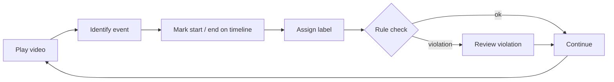

# Annotation Workflow

The core annotation loop in RIME: watch, mark, review.

## Overview

## Marking an annotation

1. Play the video and locate the event of interest
2. Press **`[`** at the event start and **`]`** at the event end
   *(or click-drag directly on the timeline lane)*
3. The label dialog opens — select the appropriate label
4. Press **Enter** to confirm

## Editing an existing annotation

- **Click** an annotation on the timeline to select it
- **Drag the edges** to adjust start / end time
- **Double-click** to re-open the label dialog
- **Delete** key to remove the selected annotation

## Navigating annotations

- The **Annotation List** panel (right sidebar) shows all annotations
- Click any row to jump to that annotation in the timeline
- Filter by lane or label using the search bar at the top of the list

## Keyboard shortcuts

| Action | Shortcut |
|---|---|
| Play / Pause | `Space` |
| Mark start | `[` |
| Mark end | `]` |
| Delete selected | `Delete` |
| Next annotation | `Tab` |
| Previous annotation | `Shift+Tab` |

!!! tip
    Keyboard shortcuts are customisable via **Preferences → Shortcuts**.
