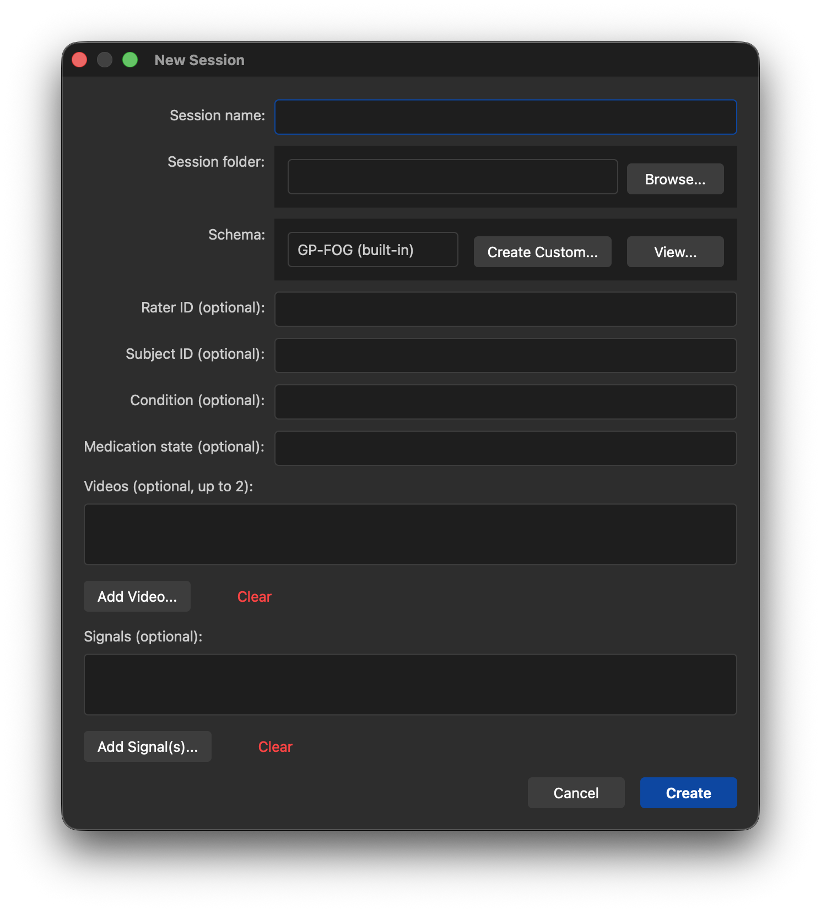
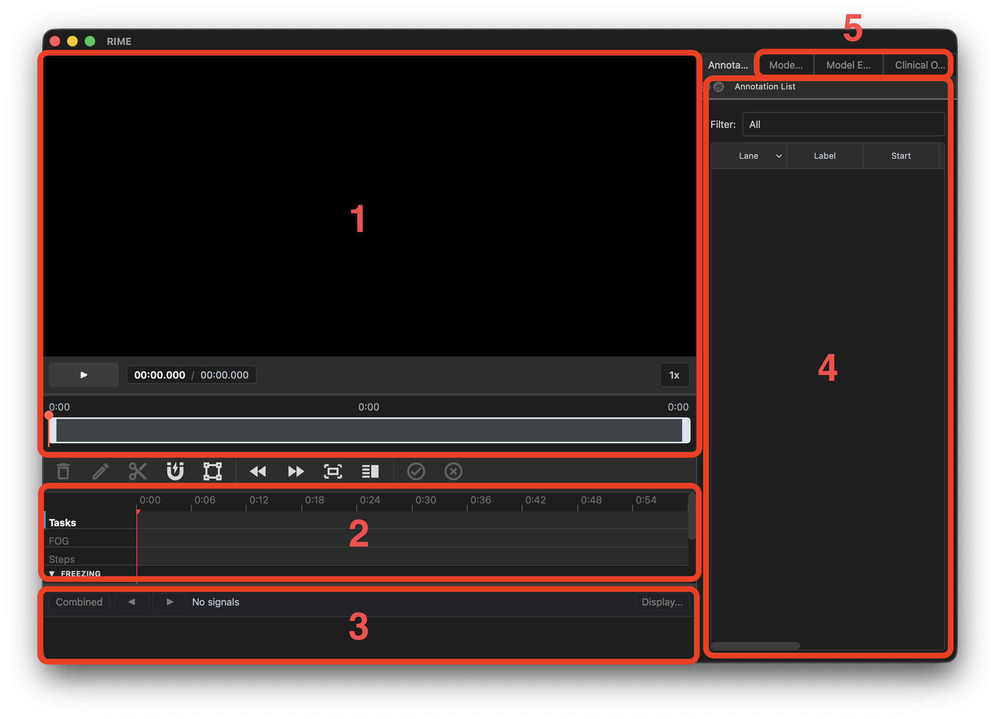

# Your First Session

This page walks through creating a new session and orienting yourself to the RIME interface.

## Create a new session

Launch RIME (`rime` in terminal), then open the Session Wizard via **Session → New Session** (`Ctrl+N`).



### 1. Session info

| Field | Description |
|---|---|
| Session folder | Root folder where `session.json` and `annotations.json` will be saved |
| Session name | Auto-filled from the folder name; edit if needed |
| Rater ID | Optional — identifies the annotator |
| Subject ID | Optional — identifies the participant |
| Condition | Optional — e.g. OFF medication, ON medication |
| Medication state | Optional |

### 2. Schema

Select a protocol schema from the dropdown. Schemas define the annotation lanes, labels, and rules used in your study.

- **Notes Only** — minimal schema, a single free-text lane
- **GP-FOG** — the Giladi Protocol FOG schema [(Gilat et al., 2026)](#references)

If you are setting up a new study with a custom schema, see [Protocol & Schema](../study-setup/protocol-schema.md) first.

### 3. Media files

Add the video and signal files recorded for this session.

**Videos** (up to 5, optional):

- Supported formats: `.mp4`, `.mov`, `.avi`
- The first video added becomes the **primary** view; additional videos are secondary

**Signals** (optional):

- Supported formats: `.csv`
- Adding a signal file opens the Signal Configuration dialog — see [Signal Configuration](../study-setup/signal-config.md)

### 4. Create

Click **Create**. RIME writes `session.json` and `annotations.json` to the session folder and opens the session.

---

## The main window



| Area | What it shows |
|---|---|
| 1. Video player | Synchronized video playback |
| 2. Timeline | Annotation lanes per label, aligned to video and signals |
| 3. Signal tracks | Raw signal data aligned to the timeline |
| 4. Annotation list | Filterable list of all annotations in the session (`F5`) |
| 5. Sidebar panels | Clinical outcomes (`F8`), IRR (`F9`), model runner (`F6`) — dockable |

## Basic navigation

- **Space** — play / pause
- **Left / Right** — step one frame
- **Shift+Left / Shift+Right** — step 10 frames
- **Click on timeline** — jump to that time point
- **Scroll on timeline** — zoom in / out
- **Ctrl+0** — zoom to fit the full session

## Next steps

- Migrating existing ELAN annotations? See [Importing from ELAN](import-from-elan.md)
- To start annotating: [Annotation Workflow](../annotation/workflow.md)

# References

```
Gilat, M., Nonnekes, J., Factor, S.A. et al. An updated definition of freezing of gait. Nat Rev Neurol 22, 172–181 (2026). https://doi.org/10.1038/s41582-025-01179-3
```