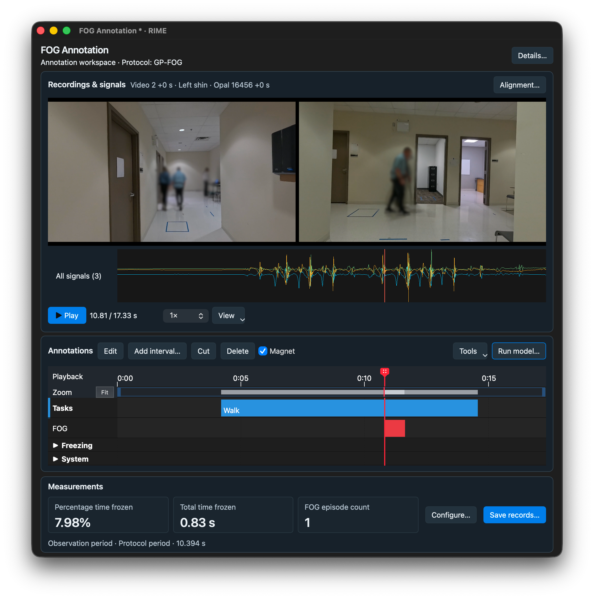
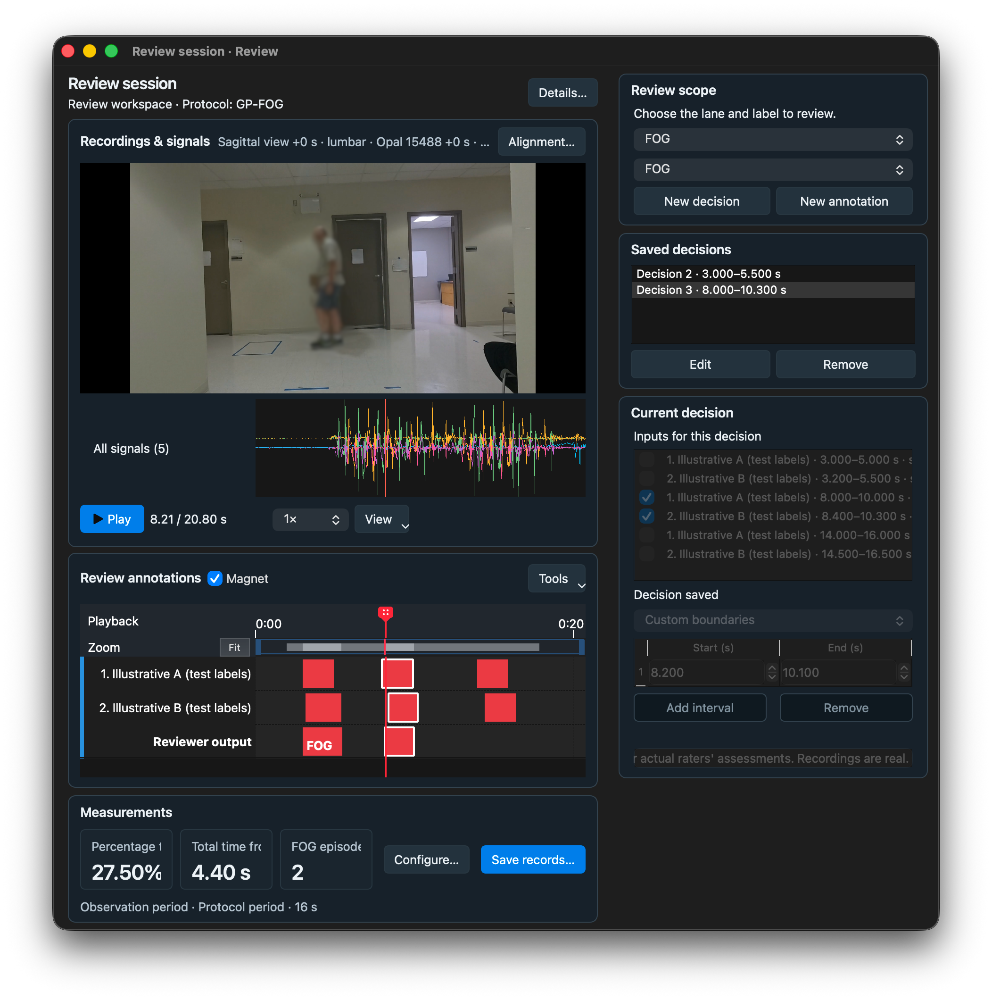
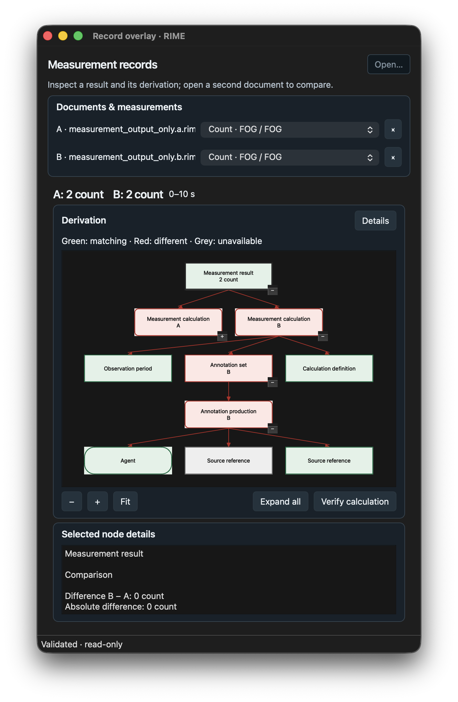

## From recordings to reproducible measurements

RIME specifies how to represent an interval-derived measurement and its derivation.
The reference application supports annotation, review, and inspection of those records.

[Create a workspace](getting-started/first-session.md) · [Try examples](examples.md) · [Read the specification](measurement-records/rime-specification.md)

### Annotate

Inspect recordings and signals, mark intervals, and save measurements.

[{ loading=lazy }](assets/screens/screen-annotate.png)

[Annotation guide →](annotation/workflow.md)

### Review

Compare input annotations and retain explicit reviewer decisions.

[{ loading=lazy }](assets/screens/screen-review.png)

[Review guide →](quality-assurance/review-layers.md)

### Inspect and compare

Verify calculations and compare the derivations of saved `.rime` records.

[{ loading=lazy }](assets/screens/screen-record.png)

[Measurement guide →](clinical-analysis/clinical-metrics.md)

