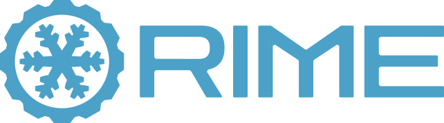

<style>
  .md-typeset h1,
  .md-content__button {
    display: none;
  }
</style>

<p align="center">
  
</p>

<div style="text-align:center; margin: 1.2rem auto 1.8rem; max-width: 520px; border-left: 3px solid #3c9dd0; padding-left: 1rem;">
  <p style="margin:0; font-size:0.85rem; color: var(--md-default-fg-color--light);">
    <strong>rime</strong> &nbsp;/rīm/&nbsp; <em>noun</em>
  </p>
  <p style="margin:0.25rem 0 0; font-size:0.9rem;">
    The crystalline structure formed by freezing fog — a record of an otherwise transient phenomenon.
  </p>
</div>

<p align="center">
  <a href="https://pypi.org/project/neurocog-rime-core/"></a>
  &nbsp;
  <a href="https://doi.org/10.5281/zenodo.19804971"></a>
  &nbsp;
  <a href="https://github.com/neurocog-mobility/rime"></a>
</p>

---

**RIME** is a multimodal annotation platform for freezing of gait (FOG) research in Parkinson's disease. It connects clinical annotators, physiological signals, and detection models on a shared timeline — and exports structured, reproducible datasets.


---

## Install

```bash
pip install neurocog-rime-core neurocog-rime-ui
```

<div style="text-align: center" markdown>
[Get Started :material-arrow-right:](getting-started/installation.md){ .md-button .md-button--primary }
[View on GitHub :material-github:](https://github.com/neurocog-mobility/rime){ .md-button }
</div>

---

## What RIME does

<div class="grid cards" markdown>

-   :material-video-box: **Synchronized review**

    ---

    Multi-view video and physiological signals on a single timeline. Annotations link directly to signal traces.

-   :material-format-list-checks: **Structured annotation**

    ---

    Protocol schemas define lanes, labels, and hierarchy. Rules enforce consistency automatically as you annotate.

-   :material-robot-outline: **Model integration**

    ---

    Load, run, and benchmark detection models directly in the annotation environment using the Common Model Format (CMF).

-   :material-chart-bar: **Clinical outcomes**

    ---

    Compute %TF, IRR, and other clinical metrics without leaving the tool. Export session reports, Parquet files, or full BIDS datasets.

</div>

---

## Who is RIME for?

<div class="borderless-table" markdown>

| If you are… | Start here |
|---|---|
| New to RIME | [Installation](getting-started/installation.md) → [Your First Session](getting-started/first-session.md) |
| Setting up a new study | [Protocol & Schema](study-setup/protocol-schema.md) |
| An annotator | [Annotation Workflow](annotation/workflow.md) |
| Building a detection model | [What is CMF?](models/what-is-cmf.md) |
| Importing existing ELAN data | [Importing from ELAN](getting-started/import-from-elan.md) |

</div>
