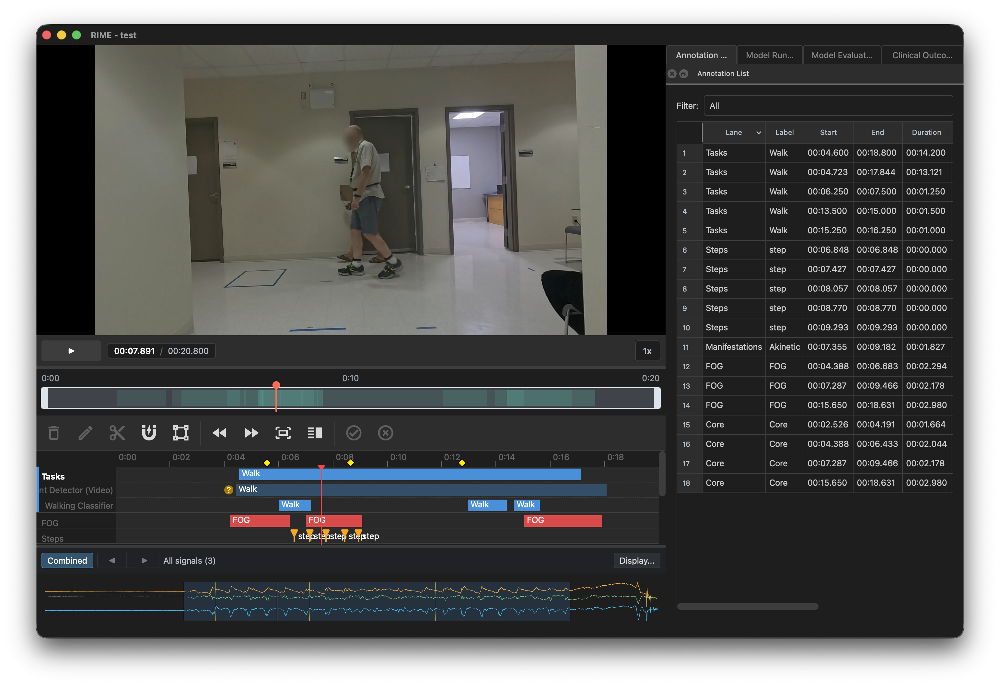

---

## What RIME does

-   :material-video-box: **Synchronized review**

    ---

    Multi-view video and physiological signals on a single timeline. Annotations link directly to signal traces.

-   :material-format-list-checks: **Structured annotation**

    ---

    Protocol schemas define lanes, labels, and hierarchy. Rules enforce consistency automatically as you annotate.

-   :material-robot-outline: **Model integration**

    ---

    Load, run, and benchmark detection models directly in the annotation environment using the Common Model Format (CMF).

-   :material-chart-bar: **Clinical outcomes**

    ---

    Compute %TF, IRR, and other clinical metrics without leaving the tool. Export session reports, Parquet files, or full BIDS datasets.

---

## Who is RIME for?

| If you are… | Start here |
|---|---|
| New to RIME | [Installation](getting-started/installation.md) → [Your First Session](getting-started/first-session.md) |
| Setting up a new study | [Protocol & Schema](study-setup/protocol-schema.md) |
| An annotator | [Annotation Workflow](annotation/workflow.md) |
| Building a detection model | [What is CMF?](models/what-is-cmf.md) |
| Importing existing ELAN data | [Importing from ELAN](getting-started/import-from-elan.md) |

