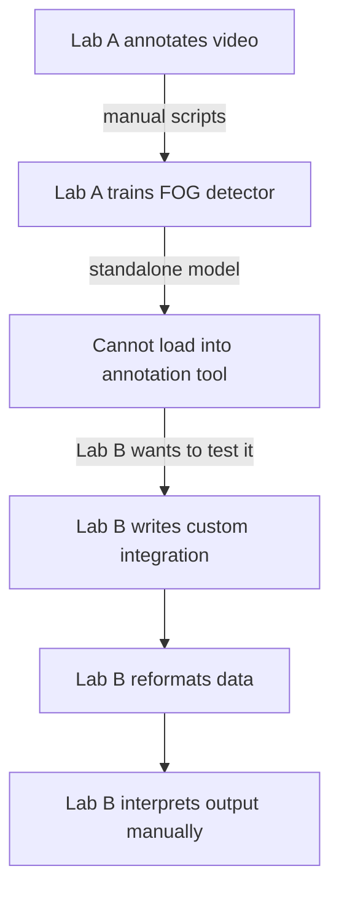
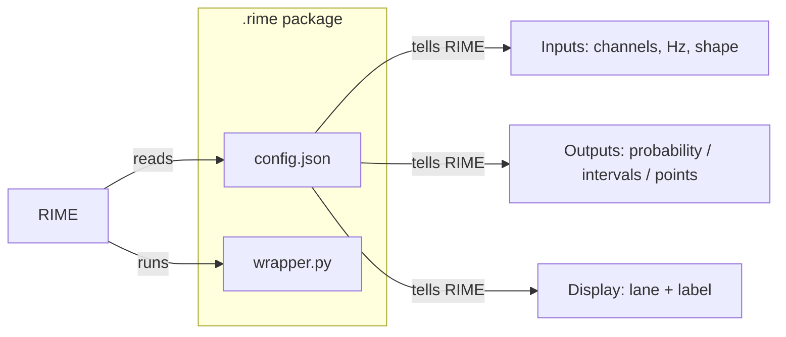

# What is CMF?

The **Common Model Format (CMF)** is a packaging standard that lets any detection model be loaded and run inside RIME — without custom integration code.

## The problem CMF solves

Today, each lab's FOG detection model is a standalone script. It reads data in one format, produces output in another, and cannot be connected to an annotation tool without significant engineering work.



The result: models accumulate in papers but cannot be compared, reused, or evaluated against gold-standard annotations without significant effort.

## The CMF contract

A CMF package declares:

1. **What it needs** — which signal channels, at what sampling rate; or video
2. **What it produces** — probabilities, event intervals, or point events
3. **Where to display output** — which annotation lane and label
4. **How to run inference** — sliding window or whole-signal
5. **What parameters the user can adjust** — thresholds, window sizes



## What a .rime package looks like

```
freeze-index.rime/
├── config.json      # the contract
└── wrapper.py       # the model
```

Any model that implements this contract can be loaded by RIME and run on any compatible session — no integration work required.

See [Loading a Model](loading-a-model.md) to get started.
