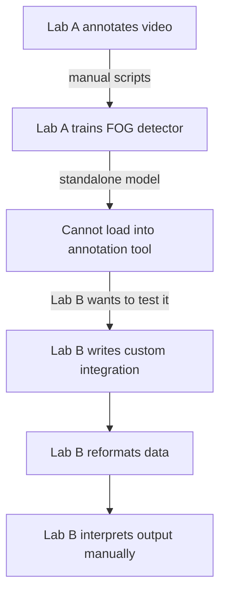

# What is CMF?

The **Common Model Format (CMF)** is an executable operator standard for model-assisted annotation. It packages the model with the declarations needed to turn bound source data into schema-typed annotations, without custom integration code.

## The problem CMF solves

Today, each lab's FOG detection model is a standalone script. It reads data in one format, produces output in another, and cannot be connected to an annotation tool without significant engineering work.



The result: models accumulate in papers but cannot be compared, reused, or evaluated against gold-standard annotations without significant effort.

## The CMF contract

A CMF package declares:

1. **What it needs** — which signal channels, at what sampling rate; or video
2. **What it produces** — probabilities, event intervals, or point events
3. **Where to display output** — which annotation lane and label
4. **How to run inference** — sliding window or whole-signal
5. **How scores become annotations** — threshold, interval reconstruction, merge gap, and minimum duration
6. **What parameters the user can adjust** — declared model-specific parameters and their defaults


## What a .cmf package looks like

```
freeze-index.cmf/
├── classifier.json  # fitted model artifact
├── config.json      # the contract
├── README.md        # method and provenance notes
└── wrapper.py       # the executable adapter
```

Any model that implements this contract can be loaded by RIME and run on any compatible session — no integration work required.

## CMF 1.1 windowed-inference semantics

CMF 1.1 makes the temporal operator explicit for windowed probability or classification outputs:

- `window_anchor: "start"` timestamps each model output at the start of its input window.
- `terminal_window: "drop"` excludes a final partial window; conforming runners never pad it implicitly.
- A decision is positive when its value is greater than or equal to `threshold`.
- Each positive decision initially covers its complete half-open input window, `[start, start + window_size_ms)`.
- Overlapping or touching positive windows are unioned. Separate intervals are additionally bridged only when their temporal gap is less than or equal to `postprocessing.merge_gap_ms`.
- `postprocessing.min_duration_ms` is applied after union and gap bridging; shorter intervals are discarded.
- Confidence is the mean of the positive decision values contributing to the retained interval. Values in a bridged negative gap are not included.

Windowed CMF 1.1 packages must declare all of these fields:

```json
"inference": {
  "mode": "windowed",
  "window_size_ms": 3000,
  "stride_ms": 500,
  "window_anchor": "start",
  "terminal_window": "drop",
  "threshold": 0.9,
  "postprocessing": {
    "merge_gap_ms": 0,
    "min_duration_ms": 0
  }
}
```

CMF 1.0 packages remain loadable with the former defaults: start-anchored complete windows, dropped terminal partial windows, and zero additional merge gap or minimum duration.

These declarations fix the computational operator; they do not establish that its construct, model, or parameter values are clinically valid. The session record separately conserves the active parameter values, input bindings, and output mappings used for a run.

See [Loading a Model](loading-a-model.md) to get started.
