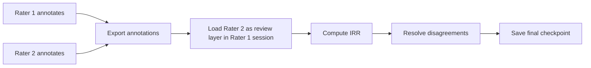

# Review Layers

A review layer loads a second set of annotations (from another rater, or a model) alongside your own, for comparison and resolution.

## What is a review layer?

Rather than overwriting your annotations, a review layer displays an external annotation set as a separate visual layer on the timeline. You can compare them side by side and decide which to accept.

## Loading a review layer

**Session → Load Review Layer**

- Select the source annotation file (exported from another RIME session, or an ELAN file)
- Choose the mode:
  - **Pending** — load as a proposed set of changes to review and accept/reject
  - **Reference** — load as a read-only reference layer (e.g. a gold standard)

## Reviewing pending annotations

- Pending annotations appear in a distinct colour on the timeline
- Click a pending annotation to accept, reject, or modify it
- Accepted annotations are merged into your primary annotation set

## Typical IRR workflow

See [Inter-Rater Reliability](irr.md) for computing IRR scores.
